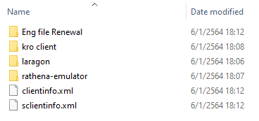

### การเตรียมพร้อม

#### สิ่งที่ต้องใช้

- Emulator
- kRO client
- mySQL server
- ไฟล์แปลเกมภาษาอังกฤษ
- Editor

**ทั้งหมดหาได้จาก เครื่องมือพื้นฐาน**

ทำการสร้าง folder (ไฟล์/แฟ้มงานเปล่า) ไว้สักที่ในที่ๆ จำง่ายๆหรือที่ๆชอบตามถนัด


รวบรวมไฟล์ทั้งหมดไว้ในที่เดียวกัน (ง่ายต่อการหา) ตามรูป



> **อธิบายรูป**\
>English file Renewal (ไฟล์แปลเกมภาษาอังกฤษ)\
>kro client (ตัวเกมส์ ro version ภาษาเกาหลี หรือ อื่นๆตามสะดวก)\
>laragon (mysql server)\
>rathena-emulator (emulator)\
>clientinfo/sclientinfo (ไฟล์กำกับทางเข้าเกมส์)

เข้าที่ไป folder kro client จากนั้นสร้าง folder ที่ชื่อว่า "data" ขึ้นมา \
หรือว่าหากมีอยู่ก่อนแล้วก็ไม่ต้องทำอะไร


นำไฟล์ clientinfo.xml หรือ sclientinfo.xml ที่เตรียมไว้เข้าไปใส่ไว้ข้างใน folder "data" \
ใน folder kro client ที่เราได้ทำการสร้างขึ้นเมื่อสักครู๋

**เพิ่มเติม**\
หากไม่มีไฟล์ clientinfo.xml หรือ sclientinfo.xml ให้ทำการสร้างขึ้นมาเอง\
เปิดโปรแกรม editor ที่มี แล้วก๊อปปี้ข้อมูลด้านล่างลงไปใส่ในไฟล์\
แล้วทำการบันทึก(save) เป็นไฟล์ clientinfo.xml หรือ sclientinfo.xml


>**clientinfo.xml/sclientinfo.xml**


```
<?xml version="1.0" encoding="tis-620" ?>

<clientinfo>
<desc>Ragnarok Client Information - Thai Version</desc>

  <servicetype>korea</servicetype>
  <servertype>primary</servertype>
  <connection>
    <display>ทดสอบนะจ๊ะ</display>
    <address>127.0.0.1</address>
    <port>6900</port>
    <version>55</version>
    <langtype>5</langtype>
    <registrationweb>localhost</registrationweb>
    <aid>
      <admin>2000000</admin>
      <admin>2000001</admin>
      <admin>2000002</admin>
      <admin>2000003</admin>
      <admin>2000004</admin>
	</aid>
	<loading>
      <image>loading00.jpg</image>
      <image>loading01.jpg</image>
      <image>loading02.jpg</image>
      <image>loading03.jpg</image>
      <image>loading04.jpg</image>
      <image>loading05.jpg</image>
      <image>loading06.jpg</image>
      <image>loading07.jpg</image>
      <image>loading08.jpg</image>
      <image>loading09.jpg</image>
	</loading>
  </connection>
</clientinfo>
```

**เพิ่มเติม**

```
<servertype>primary</servertype> หากใช้ตัวเกม ragexeRE ให้เปลี่ยนเป็น sakray
<address>127.0.0.1</address> ip ของเซิร์ฟเวอร์ นี้เป็นตัวอย่างจึงรันบนเครื่องตัวเอง (local)
<port>6900</port> port ที่ใช้เชื่อมต่อ 
<langtype>5</langtype> ภาษาในเกมส์ 5 หมายถึงสามารถพิมพ์ไทยในเกมส์ได้
<admin>2000000</admin> ทำให้ id ลำดับนั้นๆ (ลำดับ id ใน database) แสดงผลสกิน GM
<image>loading00.jpg</image> ภาพโหลดต่างๆ
```
ที่เหลือนอกจากนี้ตามหาเอาเองครับ :trollface:

**สุดท้าย**\
ไฟล์ clientinfo.xml/sclientinfo.xml นั้นจะใช้คู่กับ ragexe ที่ต่างกัน

> clientinfo.xml ใช้คู่กับ Ragexe.exe

> sclientinfo.xml ใช้คู่กับ RagexeRE.exe

ว่ากันในหัวข้ออื่นต่อไป
