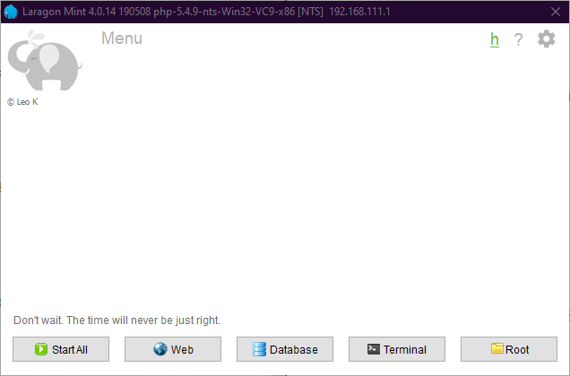

### ตั้งค่า mySQL

**สิ่งที่ต้องใช้คือ Laragon portable หาได้จากในเครื่องมือพื้นฐาน**

### ลงโปรแกรมเพิ่มให้กับ Laragon

laragon portable นั้น เบาแต่ก็มีข้อเสียโปรแกรมที่มากับตัว laragon นั้นเก่าต้องทำการอัพเดท\
ซึ่งต้องทำด้วยมือ โดยจะต้องโหลดไฟล์ 2 ไฟล์ดังนี้

> mariaDB สำหรับ windows\
> HeidiSQL version ใหม่ เพราะตัวที่แถมมานั้นไม่สามารถใช้งานได้กับ mariaDB

##### MariaDB

[MariaDB Link](https://downloads.mariadb.org/){:target="_blank"}

**ให้สังเกตุในกรอบสีแดง คือตำแหน่งที่ต้องเอาไฟล์ mariaDB ไปลงใน laragon**

> หากทำถูกจะเป็นดังรูป

##### HeidiSQL

[HeidiSQL Link](https://www.heidisql.com/download.php){:target="_blank"}

> เลือก version ที่ต้องการใช้ (ตัวอย่างนี้จะใช้ 64 bit [x64])

**ให้สังเกตุในกรอบสีแดง คือตำแหน่งที่ต้องเอาไฟล์ HeidiSQL ไปลงใน laragon\
โดยทำการลากไฟล์ใหม่ทับไฟล์เก่าที่มีทั้งหมดตามรูป**

### เริ่มใช้งาน Laragon

เปิดโปรแกรม Laragon Portable ขึ้นมา

> **สังเกตุที่ขวาล่างของจอคอม(หรือในตัวย่อ) จะเห็น icon สีเขียวๆ ตามรูป\
> ให้ทำตามรูป จนเลือก mariadb-x-winx64**

จากนั้นทำการกดปุ่ม Start All

> สังเกตุที่กรอบเขียวอ่อน หากไม่มีข้อผิดพลาดหรือ Error จากขึ้นตามรูป\
> จากนั้นไปที่ Database

กดที่ Open

> หน้าหลักของโปรแกรม HeidiSQL

คลิ๊กขวาที่ Laragon [เมนูด้านซ้ายมือ] เลือก Create new แล้วเลือก Database

> **สังเกตุในกรอบแดง จะเป็นการตั้งชื่อให้กับ database และช่อง collation\
> นั้นให้เลือก utf8_general_ci**

กดเมนูในกรอบแดง

เลือก Add ตามในรูป จากนั้น สังเกตุด้านขวาในกรอบสีเขียวอ่อน ทำให้การแก้ไข 3 อย่างนี้

> User name : (ตามที่ชอบ)\
> Password : (ตามที่ชอบ)\
> Repeat password : (ตามเมนูด้านบน password)

จากนั้น กดที่ Add object

เลือก Database ที่เราได้สร้างเมื่อสักครู่ ในตัวอย่างเป็น "ro_db" แล้วกด OK

ให้ติ๊กเครื่องหมายถูกในกรอบสีแดงทั้ง 2 เมนู ได้แก่ "Global privileges"\
และ "Database: <ชื่อ database>" จากนั้น กด save \
และ Close แล้วทำการปิดโปรแกรม heidiSQL 

ทำการเปิดโปรแกรม heidiSQL ขึ้นมาใหม่จาก Laragon กดปุ่ม "Database"\
จากนั้นทำการแก้ไข User และ Password เป็น User ที่เราทำได้ทำการสร้างขึ้นมาเมื่อสักครู่\
แล้วกดที่ save เพื่อความสะดวก จากน้้นกด Open เพื่อเข้าสู่โปรแกรมอีกครั้ง

จากเมนูด้านซ้ายมือ ให้กดเลือกที่ database เราที่สร้างขึ้นมาก่อนหน้านี้\
ในตัวอย่างเป็น "ro_db" ให้เป็นเครื่องหมายติ๊กถูกตามรูป

ที่กลางหน้าจอของโปรแกรม ให้กดไปที่แถบ "Query" จากนั้น

> **เปิด folder emulator ขึ้นมา จากนั้นเข้าไปที่ folder sql-files**

ทำการลากไฟล์ที่มีนามสกุลไฟล์ เป็น .sql ตามในรูป เข้าไปลงใน\
ช่อง "Query" ของ HeidiSQL ที่เปิดไว้ จะมีข้อมูลหรือตัวอักษรขึ้นมาตามภาพ\
จากนั้นให้กดปุ่ม "เล่น (Play)" ในกรอบสีดำ **โดยควรจะทำที่ละหนึ่งไฟล์ .sql**\
จนครบทุกไฟล์ใน folder "sql-files"

หลังจากทำขั้นตอนด้านบนเสร็จ ให้สังเกตุในกรอบสีแดง ทำการคลิ๊กขวา แล้วเลือก refreash หนึ่งครั้ง

**หากทำขั้นตอนด้านบนถูกต้องทุกขั้นตอน Database จะมีขนาดตามรูป**

เป็นอันเสร็จสิ้นขั้นตอนการตั้งค่า SQL server ซึ่งเป็นส่วนหนึ่งของเซิร์ฟเวอร์\
ที่จะใช้เก็บข้อมูลจากการรันเซิร์ฟเวอร์เกมส์ Ragnarök