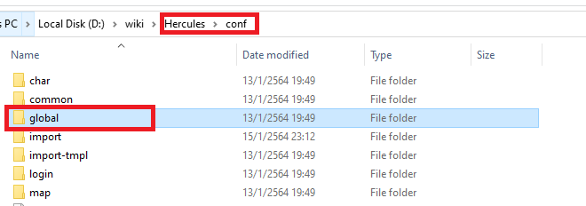
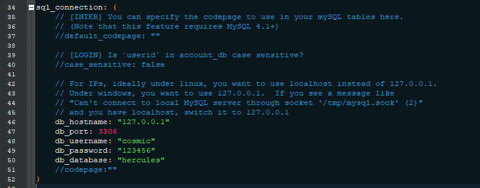

### ตั้งค่าเซิร์ฟเวอร์ (config)

**หัวข้อนี้จะเป็นการตั้งต่าเซิร์ฟก่อนที่จะทำการ build เพื่อให้รันเซิร์ฟเวอร์ได้นั้นเอง**{: style="color: red;" }

**การเรียกชื่อ emulator นั้น ผมจะทำการเรียกตามสีของหน้าแสดงผล console ได้แก่**
> **rAthena คือ สีเขียว**{: style="color: green;" }\
> **Hercules คือ สีแดง**{: style="color: red;" }

**ข้อมูลเพิ่มเติม**

สำหรับ emulator ของ Ragnarök นั้น ในการจะรันเซิร์ฟเวอร์เกมส์ได้ จะต้องมีการรันเซิร์ฟเวอร์\
ต่างๆ โดยแบ่งเป็น 3 ส่วน ได้แก่

> 1. character server หรือในชื่อสั้นๆ char server
> 2. login server
> 3. map server


### สำหรับ rAthena (เขียว)


ให้เข้าไปใน folder emulator rAthena แล้วจากนั้นให้เข้า folder **"conf"** อีกหนึ่ง folder ตามรูป


จากนั้นให้ทำการสร้าง folder เปล่าขึ้นมาชื่อ "import" แล้วเข้าไปใน folder "import"\
ให้ทำการสร้างไฟล์ 4 ไฟล์ตามรูปด้านล่าง


**ได้แก่**

> char_conf.txt\
> inter_conf.txt\
> login_conf.txt\
> map_conf.txt

โดยข้างในไฟล์นั้น (เนื้อหาไฟล์) ให้ก๊อปปี้จากด้านล่างนี้ไปใส่ในแต่ละไฟล์

**char_conf.txt**{: style="color: red;" }
```
// รหัสผ่านติดต่อกับ database (mySQL)
userid: s1
passwd: p1

// ชื่อ Server แสดงตอนเลือกเซิร์ฟเวอร์
server_name: rAthena

// ชื่อ Server แสดงตอนส่งข้อความกระซิบ
wisp_server_name: Server

// Login Server IP
login_ip: 127.0.0.1
login_port: 6900

// Character Server IP
char_ip: 127.0.0.1
char_port: 6121

// ตัวอักษรที่จะให้เซิร์ฟเวอร์อ่านในเกมส์
char_name_letters: abcdefghijklmnopqrstuvwxyz ABCDEFGHIJKLMNOPQRSTUVWXYZ1234567890 กขฃคฅฆงจฉชซฌญฎฏฐฑฒณดตถทธนบปผฝพฟภมยรลวศษสหฬอฮ ะาิีึเแโไใฤฦ_่้๊ำ็ๆฯ
```


**inter_conf.txt**{: style="color: red;" }
```
// MySQL Login server
login_server_id: database_user
login_server_pw: database_user_password
login_server_db: database_name

// IP ban
ipban_db_id: database_user
ipban_db_pw: database_user_password
ipban_db_db: database_name

// MySQL Character server
char_server_id: database_user
char_server_pw: database_user_password
char_server_db: database_name

// MySQL Map Server
map_server_id: database_user
map_server_pw: database_user_password
map_server_db: database_name

// MySQL Log Database
log_db_id: database_user
log_db_pw: database_user_password
log_db_db: database_name
```


**login_conf.txt**{: style="color: red;" }
```
// Login Server Port
login_port: 6900
```

**map_conf.txt**{: style="color: red;" }
```
// รหัสผ่านติดต่อกับ database (mySQL)
userid: s1
passwd: p1

// Character Server IP
char_ip: 127.0.0.1
char_port: 6121

// Map Server IP
map_ip: 127.0.0.1
map_port: 5121
```

**ตัวอย่างต่อไปนี้จะทำการตั้งค่าโดยใช้เครื่องตัวเอง หรือในอีกชื่อเรียก local host\
โดยที่จะไม่แก้ไข ip และ port ใดๆ ทั้งสิ้น รวมไปถึง userid และ password \
ในการติดต่อกับ database โดยจะทำให้มีไฟล์ที่ต้องแก้ไข แค่ 2 ไฟล์ ได้แก่**{: style="color: red;" }

> 1. char_conf.txt
> 2. inter_conf.txt


**ตัวอย่าง แก้ไข char_conf.txt**{: style="color: red;" }


> บรรทัดที่ 2 คือ userid ใน table "login" ใน database **หากแก้ต้องแก้ใน database ด้วย**{: style="color: red;" }\
> บรรทัดที่ 3คือ user_pass ใน table "login" ใน database **หากแก้ต้องแก้ใน database ด้วย**{: style="color: red;" }

**ตามรูปด้านล่าง**


> บรรทัดที่ 6 คือชื่อเซิรฟ์เวอร์ที่จะแสดงตอนเข้าเกมส์ หน้า login\
> บรรทัดที่ 9 คือชื่อเซิร์ฟเวอร์ที่จะแสดงว่าตอนกระซิบ\
> บรรทัดที่ 12 คือ IP สำหรับติดต่อเข้าที่ login server\
> บรรทัดที่ 13 คือ port สำหรับติดต่อเข้าที่ login server และ clientinfo.xml\
> บรรทัดที่ 16 คือ IP สำหรับติดต่อเข้าที่ char server\
> บรรทัดที่ 17 คือ port สำหรับติดต่อเข้าที่ char server\
> บรรทัดที่ 20 คือ ภาษาที่จะใช้งานในเกมส์และเก็บข้อมูล database

**ถ้าหากต้องการแก้ไข ip,port หรือ userid,password ในการติดต่อ database\
ก็จำเป็นต้องแก้ทั้ง 4 ไฟล์**

**ตัวอย่าง แก้ไข inter_conf.txt**{: style="color: red;" }


> **ให้สังเกตุ**{: style="color: red;" }\
> x_x_id : คือ user ของ mySQL ที่ถูกสร้าง\
> x_x_pw : คือ password ของ user ที่ถูกสร้าง (บรรทัดข้างบน)\
> x_x_db : ชื่อก้อน database ที่ถูกสร้าง\
> โดยที่ **X** แทนด้วยอื่นๆ จะตรงกับ หัวข้อ [ตั้งค่า mySQL](https://cosmictraveler.github.io/ro-wiki/04-ตั้งค่าmysql){:target="_blank"}
> 

**เป็นอันเสร็จในการตั้งค่าเซิร์ฟเวอร์สำหรับ rAthena (เขียว)**{: style="color: green;" }

### สำหรับ Hercules (แดง)


ให้เข้าไปใน folder emulator Hercules แล้วจากนั้นให้เข้า folder **"conf"** อีกหนึ่ง folder ตามรูป


จากนั้นให้ทำการสร้าง folder เปล่าขึ้นมาชื่อ "import" แล้วเข้าไปใน folder "import"\
ให้ทำการสร้างไฟล์ 3 ไฟล์ตามรูปด้านล่าง


**ได้แก่**

> char-server.conf\
> inter-server.conf\
> login-server.conf\
> map-server.conf

โดยข้างในไฟล์นั้น (เนื้อหาไฟล์) ให้ก๊อปปี้จากด้านล่างนี้ไปใส่ในแต่ละไฟล์

**char-server.conf**{: style="color: red;" }
```
char_configuration: {
	// ชื่อเซิร์ฟเวอร์
	server_name: "Hercules"

	// ชื่อเซิร์ฟเวอร์เวลากระซิบ
	wisp_server_name: "Server"
	
	inter: {
		// รหัสผ่านติดต่อกับ database (mySQL)
		userid: "s1"
		passwd: "p1"

		// Login Server IP
		login_ip: "127.0.0.1"
		login_port: 6900

		// Character Server IP
		char_ip: "127.0.0.1"
		char_port: 6121
	}
	
	// Character name configuration
	name: {
		// ตัวอักษรที่จะให้เซิร์ฟเวอร์อ่านในเกมส์
		name_letters: "abcdefghijklmnopqrstuvwxyz ABCDEFGHIJKLMNOPQRSTUVWXYZ1234567890 กขฃคฅฆงจฉชซฌญฎฏฐฑฒณดตถทธนบปผฝพฟภมยรลวศษสหฬอฮ ะาิีึเแโไใฤฦ_่้๊ำ็ๆฯ"

	}
	
}
```


**inter-server.conf**{: style="color: red;" }
```
inter_configuration: {
	// Log configuration
	log: {

		sql_connection: {
			db_username: "database_user"
			db_password: "database_user_password"
			db_database: "database"
		}

	}
}
```


**login-server.conf**{: style="color: red;" }
```
login_configuration: {
	inter: {
		// Login Server Port
		login_port: 6900

	}

}
```


**map-server.conf**{: style="color: red;" }
```
map_configuration: {
	inter: {
		// รหัสผ่านติดต่อกับ database (mySQL)
		userid: "s1"
		passwd: "p1"

		// Character Server IP
		char_ip: "127.0.0.1"
		char_port: 6121

		// Map Server IP
		map_ip: "127.0.0.1"
		map_port: 5121
	}
}
```

**ตัวอย่างต่อไปนี้จะทำการตั้งค่าโดยใช้เครื่องตัวเอง หรือในอีกชื่อเรียก local host\
โดยที่จะไม่แก้ไข ip และ port ใดๆ ทั้งสิ้น รวมไปถึง userid และ password \
ในการติดต่อกับ database โดยจะทำให้มีไฟล์ที่ต้องแก้ไข แค่ 1 ไฟล์ ได้แก่**{: style="color: red;" }

> 1. char-server.conf


**ตัวอย่าง แก้ไข char-server.conf**{: style="color: red;" }


> บรรทัดที่ 10 คือ userid ใน table "login" ใน database **หากแก้ต้องแก้ใน database ด้วย**{: style="color: red;" }\
> บรรทัดที่ 13 คือ user_pass ใน table "login" ใน database **หากแก้ต้องแก้ใน database ด้วย**{: style="color: red;" }

**ตามรูปด้านล่าง**


> บรรทัดที่ 3 คือชื่อเซิรฟ์เวอร์ที่จะแสดงตอนเข้าเกมส์ หน้า login\
> บรรทัดที่ 6 คือชื่อเซิร์ฟเวอร์ที่จะแสดงว่าตอนกระซิบ\
> บรรทัดที่ 14 คือ IP สำหรับติดต่อเข้าที่ login server\
> บรรทัดที่ 15 คือ port สำหรับติดต่อเข้าที่ login server และ clientinfo.xml\
> บรรทัดที่ 18 คือ IP สำหรับติดต่อเข้าที่ char server\
> บรรทัดที่ 19 คือ port สำหรับติดต่อเข้าที่ char server\
> บรรทัดที่ 25 คือ ภาษาที่จะใช้งานในเกมส์และเก็บข้อมูล database

**ถ้าหากต้องการแก้ไข ip,port หรือ userid,password ในการติดต่อ database\
ก็จำเป็นต้องแก้ทั้ง 4 ไฟล์**

**แก้ไขการติดต่อ database**{: style="color: red;" }



เข้า folder emulator hercules อีกครั้ง จากนั้นไปต่อที่ folder "conf" และ folder "global"


เปิดไฟล์ sql_connection.conf ด้วย editor vscode หรือ notepad++



**ตัวอย่างแก้ไข sql_connection.conf**

> บรรทัดที่ 48 คือ user ของ mySQL ที่ถูกสร้าง\
> บรรทัดที่ 49 คือ password ของ user ที่ถูกสร้าง (บรรทัดข้างบน)\
> บรรทัดที่ 50 ชื่อก้อน database ที่ถูกสร้าง ดูวิธีการได้จากหัวข้อ [ตั้งค่า mySQL](https://cosmictraveler.github.io/ro-wiki/04-ตั้งค่าmysql){:target="_blank"}


**เป็นอันเสร็จในการตั้งค่าเซิร์ฟเวอร์สำหรับ Hercules (แดง)**{: style="color: red;" }


