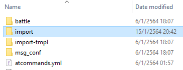
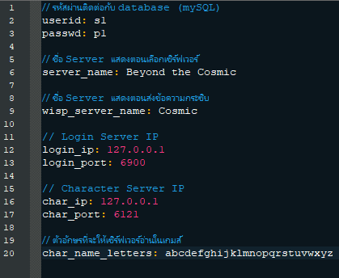
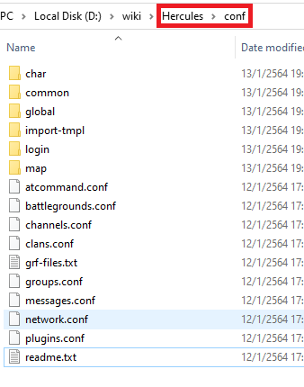

### ตั้งค่าเซิร์ฟเวอร์ (config)

**หัวข้อนี้จะเป็นการตั้งต่าเซิร์ฟก่อนที่จะทำการ build เพื่อให้รันเซิร์ฟเวอร์ได้นั้นเอง**{: style="color: red;" }

**การเรียกชื่อ emulator นั้น ผมจะทำการเรียกตามสีของหน้าแสดงผล console ได้แก่**
> **rAthena คือ สีเขียว**{: style="color: green;" }\
> **Hercules คือ สีแดง**{: style="color: red;" }

### สำหรับ rAthena (เขียว)


ให้เข้าไปใน folder emulator rAthena แล้วจากนั้นให้เข้า folder **"conf"** อีกหนึ่ง folder ตามรูป



สังเกตุไฟล์ที่มีกรอบแดงครอบไว้ นี้คือไฟล์ที่จะต้องทำการแก้ไขในการรันเซิร์ฟเวอร์\
**สำหรับส่วนอื่นๆ นั้นโปรดถามในดิสคอร์ดหรือศึกษาเอง**

> char_athena.conf ตั้งค่าสำหรับตัวละคร เมืองเกิด/ไอเท็มติดตัว/เงิน ฯ\
> inter_athena.conf ตั้งค่าเกี่ยวกับการเชื่อมต่อ database\
> login_athena.conf ตั้งค่าเกี่ยวกับการ login เชื่อมต่อเข้าเกมส์\
> map_athena.conf ตั้งค่าเกี่ยวกับแผนที่

**หมายเหตุ ขั้นตอนต่อไปในการแก้ไขไฟล์นั้น ไม่ควรเปิดไฟล์ด้วย notepad ธรรมดา\
ให้ใช้ vscode หรือ notepad++ แทน เพื่อความสะดวกแหละไม่หลอนเอง**{: style="color: red;" }

##### การแก้ไข char_athena.conf


> บรรทัด 8 คือ userid ใน table "login" ใน database **หากแก้ต้องแก้ใน database ด้วย**{: style="color: red;" } รูปด้านบนในกรอบสีแดง\
> บรรทัด 9 คือ user_pass ใน table "login" ใน database **หากแก้ต้องแก้ใน database ด้วย**{: style="color: red;" } รูปด้านบนในกรอบสีดำ\
> บรรทัด 15 คือชื่อเซิรฟ์เวอร์ที่จะแสดงตอนเข้าเกมส์ หน้า login\
> บรรทัด 16 คือชื่อเซิร์ฟเวอร์ที่จะแสดงว่าตอนกระซิบ



> บรรทัดที่ 24 หากไม่ได้รันที่เครื่องตัวเอง (local) ให้แก้เป็น ip นั้นๆ และลบ "//" ออก\
> บรรทัดที่ 37 หากไม่ได้รันที่เครื่องตัวเอง (local) ให้แก้เป็น ip นั้นๆ และลบ "//" ออก\
> บรรทัดที่ 32 คือ port ที่จะใช้งาน โดยปกติตั้งค่าไว้ที่ 6900 (จะตรงกับไฟล์ clientinfo.xml)\
> บรรทัดที่ 40 คือ port ของ เซิร์เวอร์ตัวละคร โดยปกติตั้งค่าไว้ที่ 6121


> บรรทัดที่ 159 กำหนดตัวอักษรที่เซิร์ฟเวอร์สามารถใช้งานได้

**หากต้องการให้สามารถพิมพ์ภาษาไทยได้ ให้ทำการก๊อปจากด้านล่างนี้ไปใส่**

```
char_name_letters: abcdefghijklmnopqrstuvwxyz ABCDEFGHIJKLMNOPQRSTUVWXYZ1234567890 กขฃคฅฆงจฉชซฌญฎฏฐฑฒณดตถทธนบปผฝพฟภมยรลวศษสหฬอฮ ะาิีึเแโไใฤฦ_่้๊ำ็ๆฯ

```


> บรรทัดที่ 209 เปิดใช้งานรหัสความปลอดภัยขั้นที่ 2 หากไม่ต้องการให้แก้เป็น "no"


##### การแก้ไข inter_athena.conf

สำหรับไฟล์นี้ การแก้ไขนั้นง่ายมาก ให้สังเกตุที่ 

>login_server_id: ragnarok\
login_server_pw: ragnarok\
login_server_db: ragnarok

**ให้สังเกตุที่ xxx_xxx_id , xxx_xxx_pw และ xxx_xxx_db (x แทนด้วยชื่อหรืออะไรอื่นๆ)\
แล้วแก้ตามข้างล่างให้หมด**

> _id: cosmic <id ที่ทำจากบทการตั้งค่า mySQL ในตัวอย่างเป็น cosmic >\
> _pw: 123456 <password ของ id ที่ทำในบนตั้งค่า mySQL ซึ่งผมตั้งไว้ 123456 >\
> _db: ro_db < ชื่อ database ที่ได้ทำไว้ในบน mySQL >

โดยจะมีทั้งหมด 5 ชุดข้อมูลที่ต้องที่แก้

> login_server_x\
> ipban_db_x\
> char_server_x\
> map_server_x\
> log_db_x



**หากแก้ไขถูกต้อง จะได้ดังรูปด้านบน**{: style="color: red;" }


##### การแก้ไข login_athena.conf


> บรรทัดที่ 14 คือ port ที่ใช้สำหรับเซิร์ฟเวอร์ login จะตรงกับไฟล์ clientinfo.xml


##### การแก้ไข map_athena.conf


> บรรทัดที่ 13 คือ userid ใน table "login" ใน database **หากแก้ต้องแก้ใน database ด้วย**{: style="color: red;" }\
> บรรทัดที่ 14 user_pass ใน table "login" ใน database **หากแก้ต้องแก้ใน database ด้วย**{: style="color: red;" }


> บรรทัดที่ 20 หากไม่ได้รันที่เครื่องตัวเอง (local) ให้แก้เป็น ip นั้นๆ และลบ "//" ออก\
> บรรทัดที่ 33 หากไม่ได้รันที่เครื่องตัวเอง (local) ให้แก้เป็น ip นั้นๆ และลบ "//" ออก\
> บรรทัดที่ 28 port สำหรับเซิร์ฟเวอร์ตัวละคร ค่าดั้งเดิมคือ 6121\
> บรรทัดที่ 36 port สำหรับเซิร์ฟเวอร์แผนที่ ค่าดั้งเดิมคือ 5121

### สำหรับ Hercules (แดง)

รออัพเดท