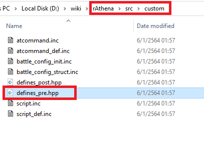
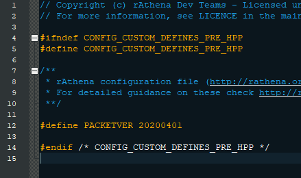
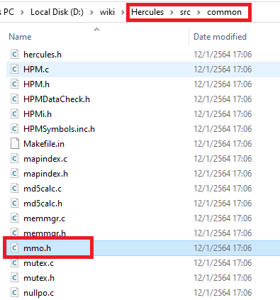
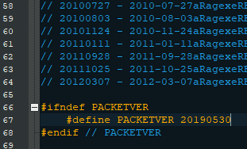
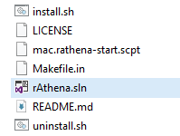
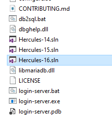
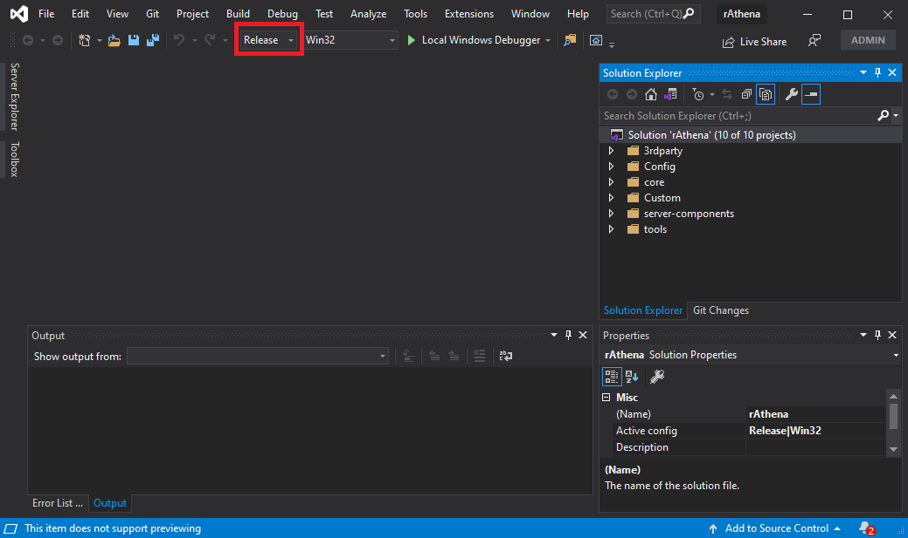
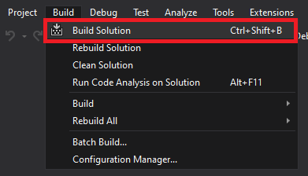
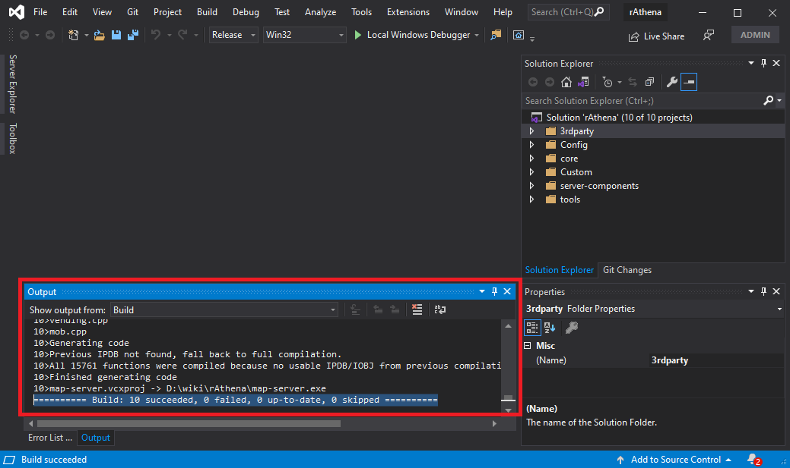

### สร้างเซิร์ฟเวอร์

สร้างเซิร์ฟเวอร์หรือการ compile เซิร์ฟเวอร์

**ทั้ง rAthena และ Hercules สำหรับบน Windows นั้นจะ compile เหมือนกัน\
โดยใช้โปรแกรม [Visual Studio](https://visualstudio.microsoft.com/){:target="_blank"}\
โดยมีวิธี compile เหมือนกัน**

### แก้ PACKET ของเซิร์ฟเวอร์

**ก่อนจะเริ่มเรื่องนี้ มีสิ่งหนึ่งที่จะต้องตัดสินใจก่อน นั้นคือ ตัวเข้าเกมส์ หรือ client\
โดยในที่นี้จะใช้ 2020-04-01bRagexe.exe ซึ่งจะมีความเกี่ยวพันกับการ\
ระบุ packet ที่จะใช้งานกับตัวเซิร์ฟเวอร์**{: style="color: red;" }

##### สำหรับ rAthena

หากใช้ rAthena ให้เข้าไปที่ folder emulator จากนั้น folder "src" และต่อด้วย folder "custom"\
จากนั้นเปิดไฟล์ "defines_pre.hpp" ขึ้นมาด้วย editor

จากนั้นให้เพิ่มบรรทัดที่ 12 ตามรูป

> #define PACKETVER 20200401

20200401 มาจากไหน มาจาก 2020-04-01bRagexe.exe โดยเอา ปี,เดือนและวันมาต่อกัน\
โดยไม่เอาตัวอักษรภาษาอังกฤษ 

**หากต้องการที่จะใช้ 2020-07-15bRagexe.exe แทน ? ก็จะเป็น 20200715 แทน**{: style="color: red;" }

##### สำหรับ Hercules

หากใช้ Hercules ให้เข้าไปที่ folder emulator จากนั้น folder "src" และต่อด้วย folder "common"\
จากนั้นเปิดไฟล์ "mmo.h" ขึ้นมาด้วย editor

บรรทัดที่ 67 ให้แก้ PACKETVER ที่ใช้ตาม client

### compile เซิร์ฟเวอร์

หากใช้ rAthena ให้เข้าไปที่ folder emulator จากนั้นเปิดไฟล์ "rAthena.sln" ด้วย visual studio

หากใช้ Hercules ให้เข้าไปที่ folder emulator จากนั้นเปิดไฟล์ "Hercules-16.sln" ด้วย visual studio

ในกรอบสีแดงให้ปรับจาก "Debug" มาเปลี่ยน "Release" แทน ทั้ง rAthena และ Hercules

จากนั้นกดที่เมนู Build บนแทบเครื่องมือด้านบน แล้วเลือก Build Solution จากนั้นก็นั่งรอ

เซิร์ฟเวอร์ได้ทำการ compile สำเร็จพร้อมที่จะ [รันเซิร์ฟเวอร์](https://cosmictraveler.github.io/ro-wiki/07-รันเซิร์ฟเวอร์){:target="_blank"}