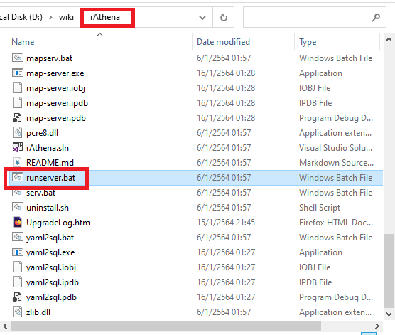
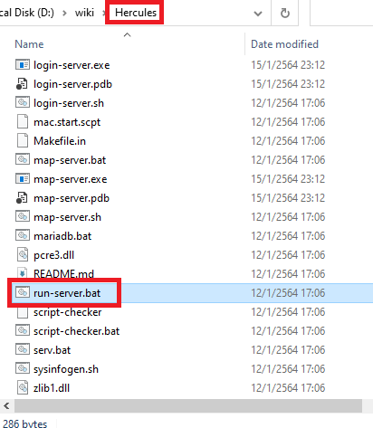
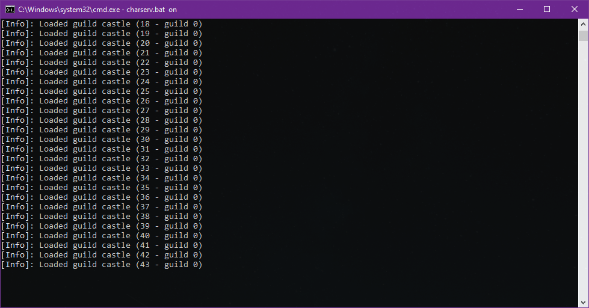
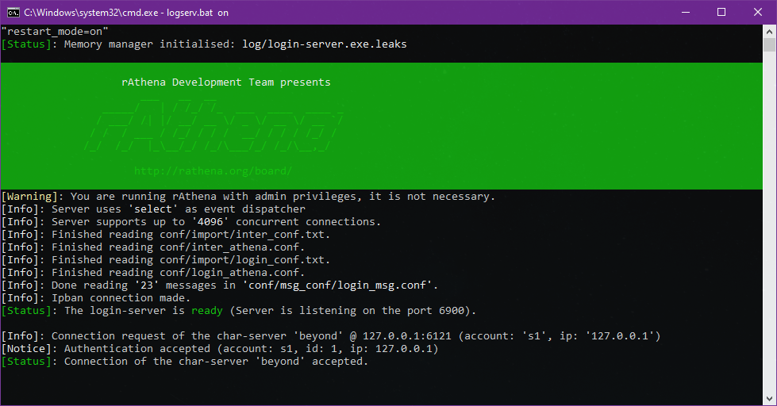
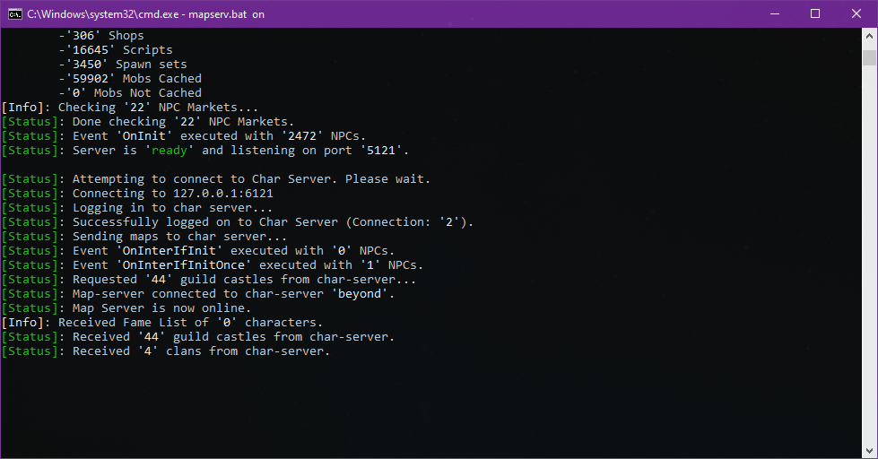

### รันเซิร์ฟเวอร์

**การรันเซิร์ฟเวอร์นั้น จะรันเหมือนกันทั้ง rAthena และ Hercules โดยจะมีลำดับการรันเซิร์ฟเวอร์ดังนี้**
1. char-server -> 2. login-server -> 3. map-server

ต้องรันผ่านหมดทั้งสามตัว จึงจะสามารถเข้าเล่นเกมส์โดยไม่มีปัญหาต่างๆ

หากใช้ emulator rAthena ให้เข้าไปที่ folder emulator จากนั้นรันไฟล์ที่ชื่อว่า "runserver.bat" ตามรูป

หากใช้ emulator Hercules ให้เข้าไปที่ folder emulator จากนั้นรันไฟล์ที่ชื่อว่า "run-server.bat" ตามรูป

หลังจากกดรันเซิร์ฟเวอร์ไปแล้ว จะปรากฏหน้าต่าง console ต่างๆขึ้นมา 3 หน้าต่าง (จะช้าหรือเร็วอยู่ที่เครื่อง)\

**console แรก**

**หากขึ้นตามรูปด้านบน แสดงว่าตั้งค่าต่างๆได้ถูกต้อง**{: style="color: red;" }

**console สอง**

**หากขึ้นตามรูปด้านบน แสดงว่าตั้งค่าต่างๆได้ถูกต้อง**{: style="color: red;" }

**console สาม**

**หากขึ้นตามรูปด้านบน แสดงว่าตั้งค่าต่างๆได้ถูกต้อง**{: style="color: red;" }
