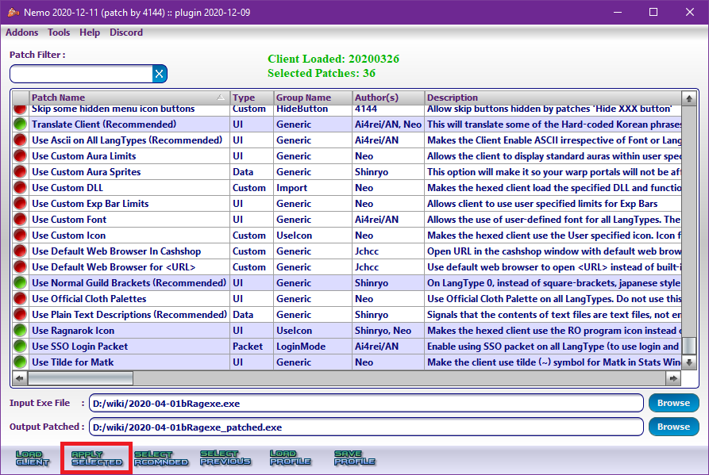

### ดิฟตัวเกมส์

**ต้องเตรียมไฟล์ที่ต้องใช้ต่อไปนี้**{: style="color: red;" }

> 1. Ragexe หรือ RagexeRE 1 ไฟล์ หาได้จาก
> 2. N.E.M.O.
> 3. N.E.M.O. profile อยู่ในกับไฟล์แปลเกมส์ภาษาอังกฤษ

[ไฟล์ต่างๆ](https://cosmictraveler.github.io/ro-wiki/02-เครื่องมือพื้นฐาน)

**N.E.M.O. profile**

{:width="75%"}

เปิดโปรแกรม N.E.M.O. ขึ้น

{:width="75%"}

1. browse หรือ เลือกไฟล์ จากนั้นเลือกไฟล์ Ragexe.exe ที่ต้องการ ในตัวอย่างจะใช้ "2020-04-01bRagexe.exe"\
ซึ่งได้ตั้งค่ากับเซิร์ฟเวอร์ไว้ก่อนหน้านี้ ตามรูปด้านล่าง
2. จากนั้นกดปุ่ม load client เพื่อทำการโหลดข้อมูลจากตัวเข้าเกมส์

{:width="75%"}

หลังจากโหลดข้อมูลเสร็จ ให้กดที่ปุ่ม load profile

จากนั้นเลือก N.E.M.O. profile ให้ตรงกับ Ragexe ที่ใช้ ซึ่งในที่นี้ใช้ Ragexe ปี 2020 จึงใช้ไฟล์ "2020_Translation.log"

{:width="75%"}

จะมีหน้าต่างเด้งขึ้นมา ให้สามารถปรับแต่งต่างๆเกี่ยวกับตัวไคลเอ็นท์ (client) ของเกมส์ สามารถแก้ไขได้ตามใจชอบ
จากนั้นกดที่ปุ่ม OK\
**จะมีเด้งขึ้นมาหลายหน้าต่าง โปรดอ่านดีๆก่อนกด OK**{: style="color: red;" }

**หลังจาก OK จนหมด สามารถเพิ่มหรือลบอปชั่นของไคลเอ็นท์ได้ตามใจชอบ บางอย่างอาจจะ Error**{: style="color: green;" }

{:width="75%"}

กดปุ่ม "apply selected" เพื่อทำการดิฟตัวเข้าเกมส์

{:width="75%"}

การดิฟตัวเข้าเกมส์เสร็จสิ้น

ในกรอบสีแดงคือ ตัวเข้าเกมส์ที่เราได้ทำการดิฟออกมาเมื่อสักครู่นี้เอง สามารถนำไปใช้งานได้