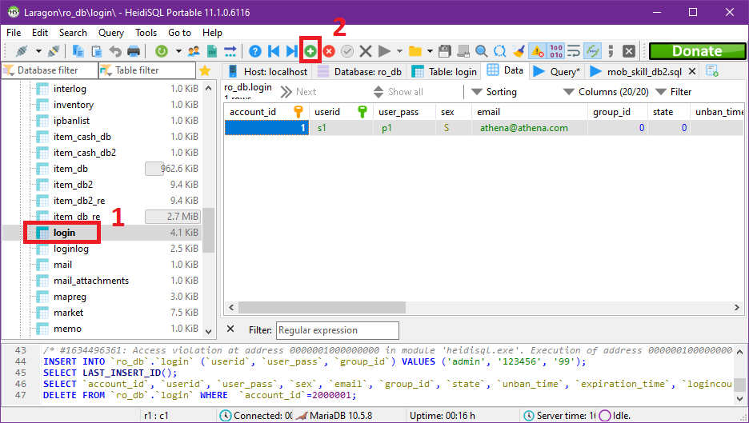
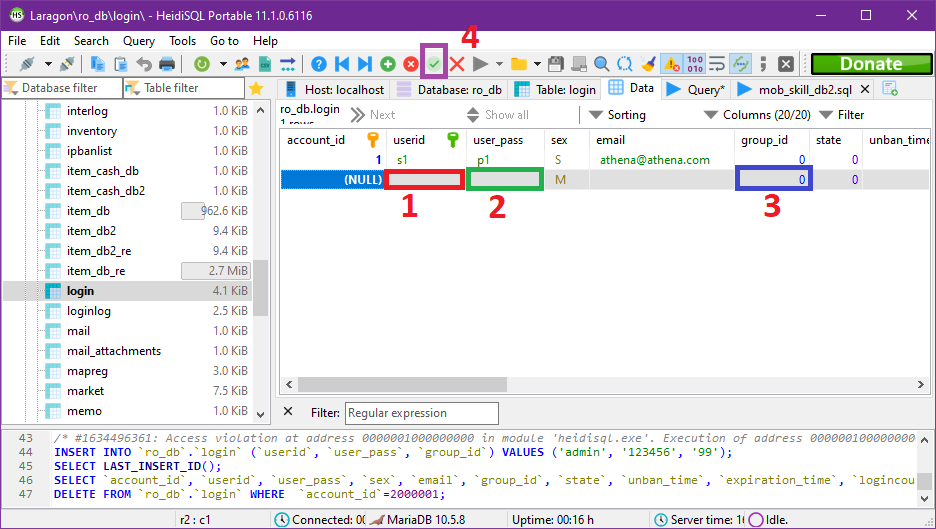
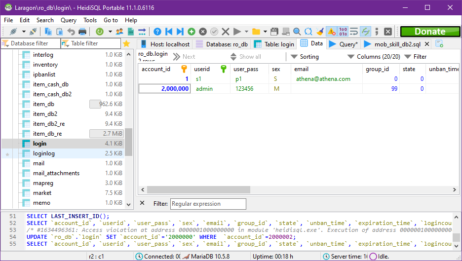
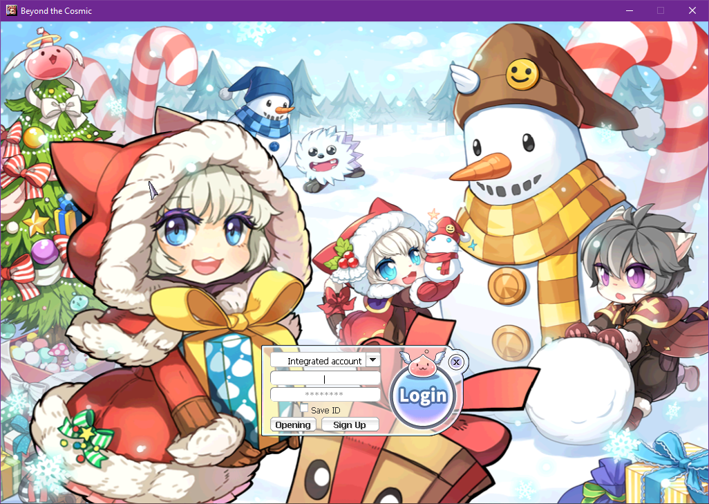
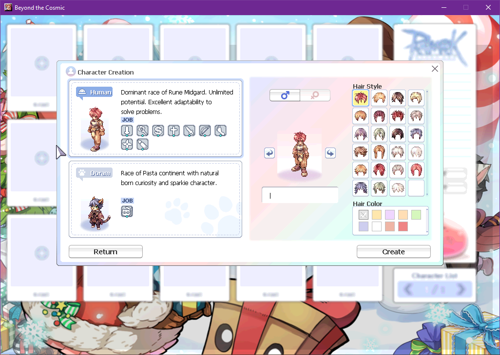
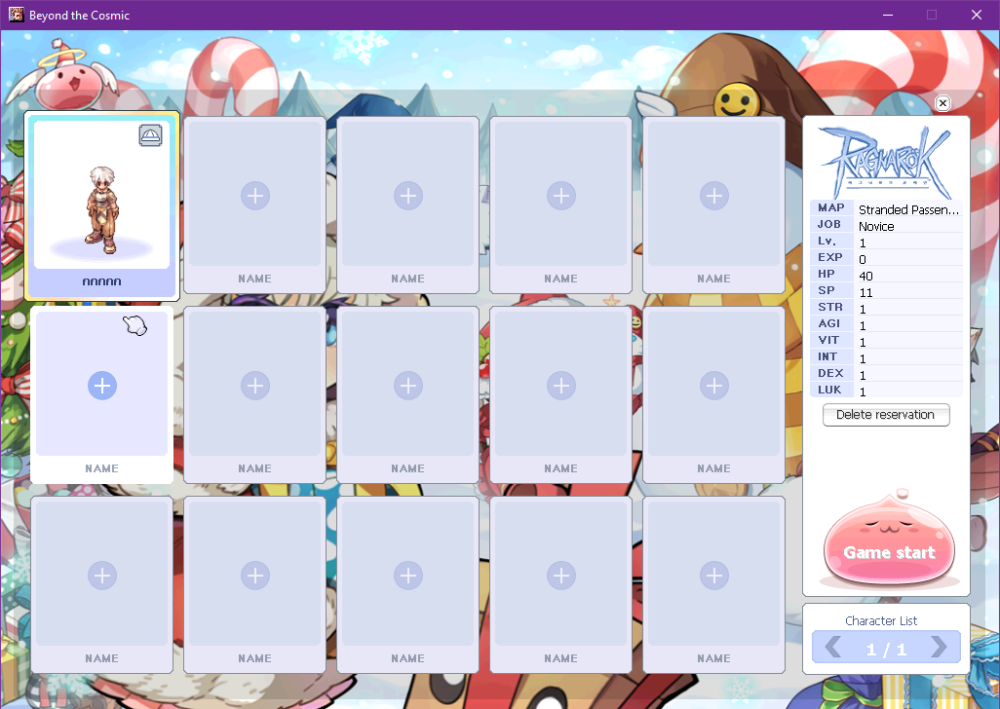
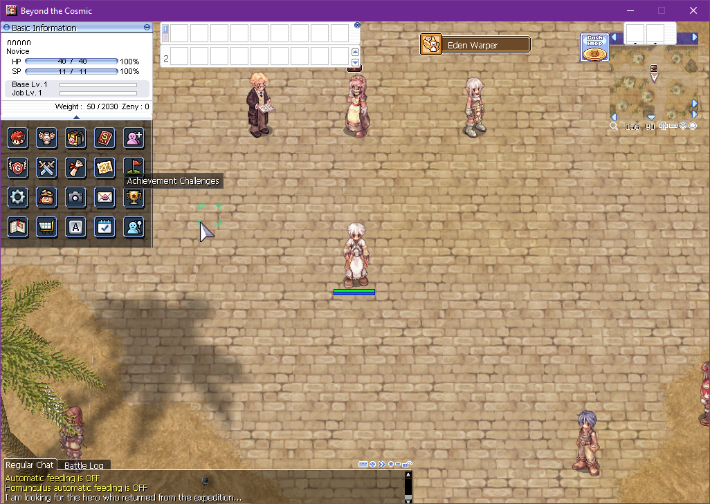

### ทดสอบเข้าเกมส์

**ต้องรันสิ่งต่อไปนี้ก่อน ถึงจะเข้าเกมส์ได้**{: style="color: red;" }

> 1. laragon (database)
> 2. เซิร์ฟเวอร์ (char,login,map server)

**และอย่าลืม ไฟล์ clientinfo.xml ต้องตรงกับเซิร์ฟเวอร์**{: style="color: red;" }

เพิ่มเติม อย่างลืมลงไฟล์แปลเกมส์ภาษาอังกฤษ ไม่งั้นจะเข้าเกมส์ไม่ได้ เพราะดิฟมาให้อ่านไฟล์แปล

{:width="75%"}

เข้า database จาก laragon แล้ว login จากนั้นหาตาราง (table) กรอบสีแดงที่ 1\
เมื่อเจอแล้วให้กดที่กรอบสีแดงที่ 2

{:width="75%"}

ที่กรอบสีที่ 1 ให้ใส่ id ในกรอบที่ 2 password และ กรอบที่ 3 ใส่ "99" จากนั้นที่กรอบสีที่ 4 ให้กดปุ่มเครื่องหมายถูกต้อง
เพื่อ **เป็นการสร้าง id เข้าเกมส์ id แรก**{: style="color: red;" }

**สามารถไปปรับ conf ให้ทำการอ่านวิธีสมัครโดยใช้ _M/_F ได้**{: style="color: yellow;" }

{:width="75%"}

หากทำถูกต้องจะได้ดังภาพ จากนั้นสามารถออกโปรแกรม heidiSQL ได้เลย

{:width="75%"}

เข้าเกมส์ผ่านไคลเอ็นท์ที่ดิฟมา และ login

{:width="75%"}

ทำการสร้างตัวละคร

{:width="75%"}

ตัวละครชื่อภาษาไทย

{:width="75%"}

ภาพในเกมส์ (วาปออกมาจากเรือล้ม)

เป็นอันเสร็จในในหัวข้อนี้