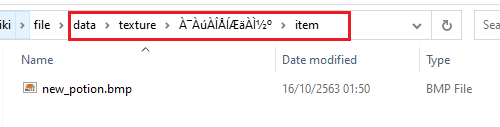
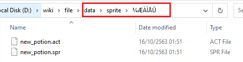
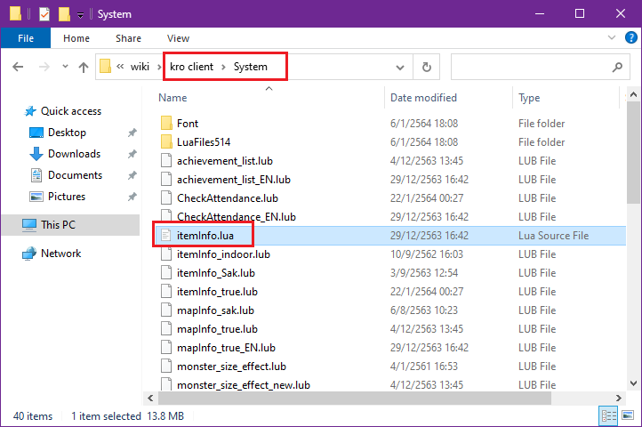

### ลงไอเท็มธรรมดา หรือกดใช้

**ให้เตรียมไฟล์ให้ไอเท็มให้พร้อม โดยไฟล์จะประกอบไปด้วย**


> 1. ไฟล์ .act
> 2. ไฟล์ .spr
> 3. ไฟล์รูปไอคอนเล็กๆ .bmp
> 4. ไฟล์รูปไอเท็มแสดงผลเหมือนคลิ๊กขวาดูข้อมูลไอเท็ม .bmp
> 5. **เพิ่มเติม**{: style="color: red;" } ไฟล์ .str สำหรับไอเท็มกดใช้ที่จะมี effect แสดง

**ตัวอย่างจะเป็นการลงไอเท็มใน folder "data" เท่านั้น**{: style="color: red;" }

**สำหรับตัวอย่างจะเป็นการลง "ยาแดง" เพิ่มเข้าไป**

```text
โครงสร้าง folder ของ data/
│
│
├── texture/ (เก็บไฟล์ภาพต่างๆ และ effect)
│   │
│   ├── effect/
│   │   └── <ไฟล์ .str>
│   │
│   └── "À¯ÀúÀÎÅÍÆäÀ̽º"/
│       ├── collection/
│       │   └── <ไฟล์รูปสำหรับโชว์คลิ๊กขวา .bmp>
│       │
│       └── item/
│           └── <ไฟล์รูปไอคอนเล็กๆ .bmp>
│   
├── sprite/ 
│       └── "¾ÆÀÌÅÛ"/
│           └── <เก็บไฟล์ .act/.spr>
│ 
```

**แก้ชื่อไฟล์ให้ตรงกัน ทั้ง 4 หรือ 5 ไฟล์ ในตัวอย่างจะใช้ชื่อ "new_potion"**








### การแก้ไอเท็มฝั่งเซิร์ฟเวอร์


จากนั้นเข้า folder emulator และไปที่ folder "db" จากนั้น folder "import" เปิดไฟล์ "item_db.yml" ด้วย editor


**ก่อนเพิ่มไอเท็มให้ทำการเพิ่ม "body:" ลงไปก่อน**{: style="color: red;" }

ทำการกรอกข้อมูลของไอเท็มลงไป

```yml
  - Id: 1100100                                     # เลขไอเท็มห้ามซ้ำ
    AegisName: HI_New_Potion                        # ชื่อที่ติดต่อกับตัวเกมส์ห้ามซ้ำ ห้ามเว้นวรรค
    Name: HI Red Potion                             # ชื่อไอเท็ม
    Type: Healing                                   # ประเภทของไอเท็ม
    Buy: 10                                         # ราคาขาย
    Weight: 70                                      # น้ำหนัก 70 ในเกมส์จะเท่ากับ 7 [หารด้วย 10]
    Script: |
      itemheal 150,0;                               # สคริปของไอเท็ม สามารถปรับแต่งตามใจชอบ
```

ในกรณีที่ต้องทำการลงไอเท็มธรรมดา ไม่สามารถกดใช้ได้


```yml
  - Id: 1100101                                     # เลขไอเท็มห้ามซ้ำ
    AegisName: Elunium_Stone_1                      # ชื่อที่ติดต่อกับตัวเกมส์ห้ามซ้ำ ห้ามเว้นวรรค
    Name: New Rough Elunium                         # ชื่อไอเท็ม
    Type: Etc                                       # ประเภทของไอเท็ม
    Buy: 650                                        # ราคาขาย
    Weight: 200                                     # น้ำหนัก 70 ในเกมส์จะเท่ากับ 7 [หารด้วย 10]
    Flags:                                          # กำหนดประเภทให้ไอเท็ม
      BuyingStore: true                             # กำหนดให้มีขายในร้านค้า
```

### การแก้ไอเท็มตัวเกมส์ (client)



เข้าไปที่ folder เกมส์ จากนั้นเข้า folder "System" และเปิดไฟล์ "itemInfo.lua" / .lub ขึ้นมาด้วย **editor (แนะนำ ครั้งแรกให้ใช้ vscode ก่อน)**{: style="color: red;" }\
ไฟล์ที่จะเรียกใช้จะไม่เหมือนการ ตามการดิฟ client ของแต่ละคน

**ตามตัวอย่างจะใช้ไฟล์ itemInfo.lua**{: style="color: red;" }

{:width="75%"}

หลังจากเปิดโปรแกรม vscode ขึ้นมาแล้ว ให้สังเกตุมุมขวาล่างของโปรแกรม ตามภาพ จากนั้นคลิ๊กที่ UTF-8 หนึ่งครั้ง

{:width="75%"}

จะปรากฏหน้าต่างให้เลือก ด้านบนของโปรแกรม ให้ทำการเลือก "Reopen with encoding"

{:width="75%"}

จากนั้นเลื่อนหน้าต่างนั้นลงมาเรื่อยๆจะเจอ "Thai (Windows 874)" กดเลือกไป

{:width="75%"}

จากนั้นเลื่อนหน้าจอลงไปล่างสุดและย้อนกลับขึ้นมาเล็กน้อย ให้สังเกตุในกรอบสีแดง 
**จะเป็นที่เพิ่มไอเท็มชิ้นต่อๆไป "<< เพิ่มต่อจากตรงนี้" ไม่เกี่ยวนะเออ ดูดีๆ**{: style="color: red;" }

{:width="75%"}

เพิ่มข้อมูลไอเท็มที่เราต้องการเพิ่มเข้าไปในเกมส์ลงไป

**Script ตัวอย่าง**

```lua
[1100100] = {                                                   # เลขไอเท็มให้ตรงกับที่แก้ในไฟล์ import ด้านบน
		unidentifiedDisplayName = "Hi Red Potion",      # ชื่อที่แสดงตอนยังไม่
		unidentifiedResourceName = "new_potion",        # ชื่อไฟล์ที่จะเรียกมาแสดงผล
		unidentifiedDescriptionName = { "" },           # คำอธิบายไอเท็มตอนยังไม่ส่อง
		identifiedDisplayName = "Hi Red Potion",        # ชื่อแสดงหลังส่อง
		identifiedResourceName = "new_potion",          # ชื่อไฟล์ที่จะเรียกมาแสดงผลหลังส่อง
		identifiedDescriptionName = {
			"A bottle of potion made from grinded Red Herbs.",
			"________________________",
			"^0000CCType:^000000 Restorative",
			"^0000CCHeal:^000000 150 HP",
      "^0000CCWeight:^000000 7"
		},                                              # คำอธิบายไอเท็มหลังส่อง 
		slotCount = 0,                                  # จำนวนรูใส่การ์ด
		ClassNum = 0,                                   # หมายเลขไอดีแสดงผลจำพวก หมวก/ปาก/หัว
		costume = false                                 # เป็นคอสตูม ใช่บ่
	},
```

เป็นอันเสร็จ ทดลองเข้าเกมส์แล้วเสกดู


