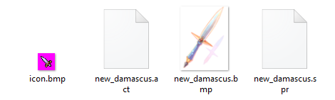
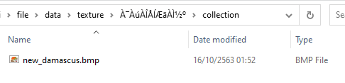
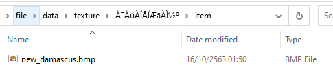
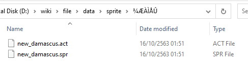
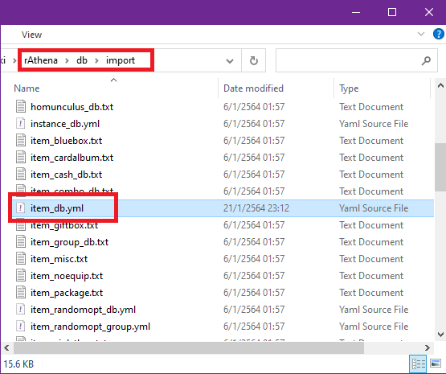
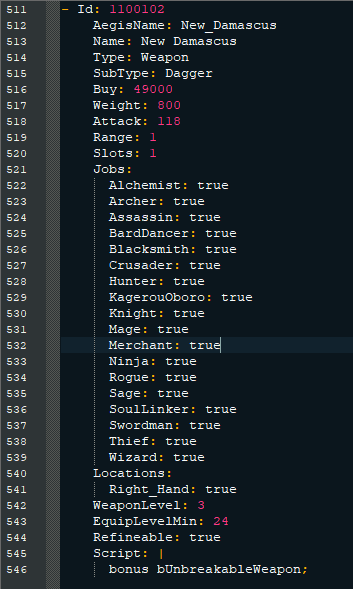
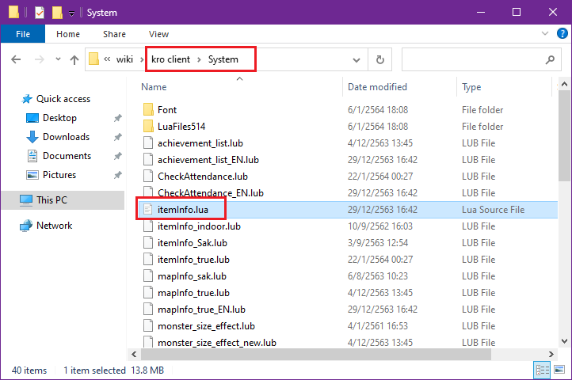
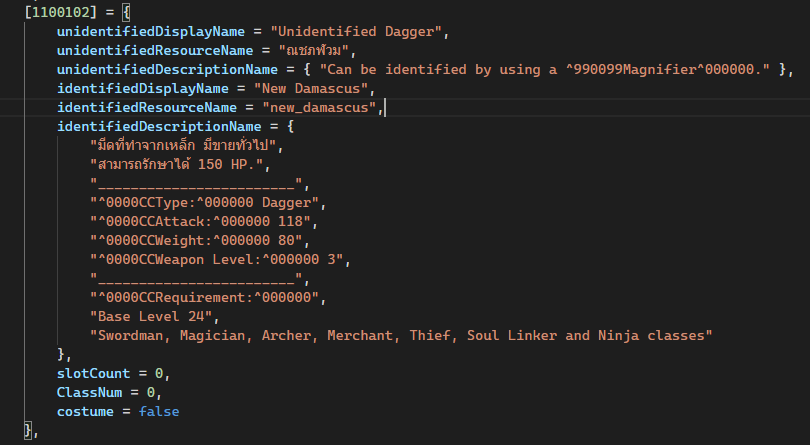
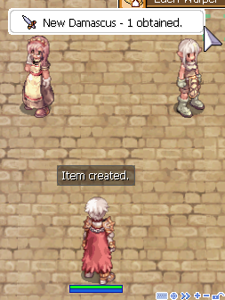
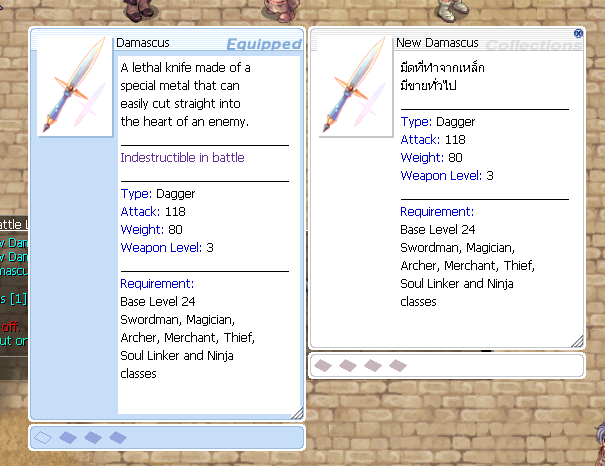

### ลงไอเท็มส่วมใส่

**ในหัวข้อนี้นั้น จะแบ่งออกมาเป็น 2 หัวข้อได้แก่**

> 1. อาวุธ/ชุดเกราะ
> 2. หัว/ปาก

### อาวุธ/ชุดเกราะ

**ให้เตรียมไฟล์ให้ไอเท็มให้พร้อม โดยไฟล์จะประกอบไปด้วย**



> 1. ไฟล์ .act
> 2. ไฟล์ .spr
> 3. ไฟล์รูปไอคอนเล็กๆ .bmp
> 4. ไฟล์รูปไอเท็มแสดงผลเหมือนคลิ๊กขวาดูข้อมูลไอเท็ม .bmp

**ตัวอย่างจะเป็นการลงไอเท็มใน folder "data" เท่านั้น**{: style="color: red;" }

**สำหรับตัวอย่างจะเป็นการลง "มีด damascus อันใหม่" เพิ่มเข้าไป**

```text
โครงสร้าง folder ของ data/
│
│
├── texture/ (เก็บไฟล์ภาพต่างๆ และ effect)
│   │
│   │
│   └── "À¯ÀúÀÎÅÍÆäÀ̽º"/
│       ├── collection/
│       │   └── <ไฟล์รูปสำหรับโชว์คลิ๊กขวา .bmp>
│       │
│       └── item/
│           └── <ไฟล์รูปไอคอนเล็กๆ .bmp>
│   
├── sprite/ 
│       └── "¾ÆÀÌÅÛ"/
│           └── <เก็บไฟล์ .act/.spr>
│ 
```

**แก้ชื่อไฟล์ให้ตรงกัน ทั้ง 4 ในตัวอย่างจะใช้ชื่อ "new_damascus"**










#### การแก้ไอเท็มฝั่งเซิร์ฟเวอร์



จากนั้นเข้า folder emulator และไปที่ folder "db" จากนั้น folder "import" เปิดไฟล์ "item_db.yml" ด้วย editor



ทำการกรอกข้อมูลของไอเท็มลงไป

```yml
- Id: 1100102                                    # เลขไอเท็มห้ามซ้ำ
    AegisName: New_Damascus                      # ชื่อที่ติดต่อกับตัวเกมส์ห้ามซ้ำ ห้ามเว้นวรรค
    Name: New Damascus                           # ชื่อไอเท็ม
    Type: Weapon                                 # ประเภทของไอเท็ม
    SubType: Dagger                              # ประเภทของอาวุธ
    Buy: 49000
    Weight: 800
    Attack: 118
    Range: 1
    Slots: 1
    Jobs:                                        # อาชีพที่ใช้ได้
      Alchemist: true
      Archer: true
      Assassin: true
      BardDancer: true
      Blacksmith: true
      Crusader: true
      Hunter: true
      KagerouOboro: true
      Knight: true
      Mage: true
      Merchant: true
      Ninja: true
      Rogue: true
      Sage: true
      SoulLinker: true
      Swordman: true
      Thief: true
      Wizard: true
    Locations:                                  # ตำแหน่งในตัว เช่น มือขวา มือซ้าย
      Right_Hand: true
    WeaponLevel: 3                              # เลเวลของอาวุธ
    EquipLevelMin: 24                           # เลเวลขั้นต่ำที่สามารถใช้ได้
    Refineable: true                            # สามารถตีบวกได้หรือไม่
    Script: |                                   # สคริปของไอเท็ม สามารถศึกษาเพิ่มได้ได้ใน folder "doc" ไฟล์ "item_bonus.txt"
      bonus bUnbreakableWeapon;
```

#### การแก้ไอเท็มตัวเกมส์ (client)



เข้าไปที่ folder เกมส์ จากนั้นเข้า folder "System" และเปิดไฟล์ "itemInfo.lua" / .lub ขึ้นมาด้วย **editor (แนะนำ ครั้งแรกให้ใช้ vscode ก่อน)**{: style="color: red;" }\
ไฟล์ที่จะเรียกใช้จะไม่เหมือนการ ตามการดิฟ client ของแต่ละคน

**ตามตัวอย่างจะใช้ไฟล์ itemInfo.lua**{: style="color: red;" }

**หลังจากเปิดไฟล์แล้ว ให้ reopen with encoding "Thai" ส่วนวิธีหาอ่านได้ที่บท [ลงไอเท็มธรรมดา](https://cosmictraveler.github.io/ro-wiki/10-ลงไอเท็ม)**{: style="color: red;" }



เพิ่มข้อมูลไอเท็มที่เราต้องการเพิ่มเข้าไปในเกมส์ลงไป

**Script ตัวอย่าง**

```lua
	[1100102] = {
		unidentifiedDisplayName = "Unidentified Dagger",
		unidentifiedResourceName = "ณชภฬวม",
		unidentifiedDescriptionName = { "Can be identified by using a ^990099Magnifier^000000." },
		identifiedDisplayName = "New Damascus",
		identifiedResourceName = "new_damascus",
		identifiedDescriptionName = {
			"มีดที่ทำจากเหล็ก มีขายทั่วไป",
			"________________________",
			"^0000CCType:^000000 Dagger",
			"^0000CCAttack:^000000 118",
			"^0000CCWeight:^000000 80",
			"^0000CCWeapon Level:^000000 3",
			"________________________",
			"^0000CCRequirement:^000000",
			"Base Level 24",
			"Swordman, Magician, Archer, Merchant, Thief, Soul Linker and Ninja classes"
		},
		slotCount = 0,
		ClassNum = 0,
		costume = false
	},
```

เป็นอันเสร็จ ทดลองเข้าเกมส์แล้วเสกดู





### หัว/ปาก
