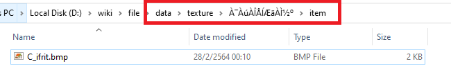

### ลงคอสตูมส่วนหัว

**ให้เตรียมไฟล์คอสตูมให้พร้อม โดยไฟล์จะประกอบไปด้วย**


> 1. ไฟล์ .act ไฟล์แสดงผลเวลากดเมาส์ลากหรือใส่ในช่องตัวละคร
> 2. ไฟล์ .spr ไฟล์แสดงผลเวลากดเมาส์ลากหรือใส่ในช่องตัวละคร
> 3. ไฟล์รูปไอคอนเล็กๆ .bmp
> 4. ไฟล์รูปไอเท็มแสดงผลเหมือนคลิ๊กขวาดูข้อมูลไอเท็ม .bmp
> 5. ¿©_<ชื่อไฟล์>.act //  ไฟล์แสดงผล costume ญ
> 6. ¿©_<ชื่อไฟล์>.spr // ไฟล์แสดงผล costume ญ
> 7. ³²_<ชื่อไฟล์>.act // ไฟล์แสดงผล costume ช
> 8. ³²_<ชื่อไฟล์>.spr // ไฟล์แสดงผล costume ช

**ตัวอย่างจะเป็นการลงคอสตูม folder "data" เท่านั้น**{: style="color: red;" }

**สำหรับตัวอย่างจะเป็นการลง "คอสตูม frit" เพิ่มเข้าไป**

```text
>> FILE PATH <<
โครงสร้าง folder ของ data/
│
│
├── texture/
│   │
│   │
│   └── "À¯ÀúÀÎÅÍÆäÀ̽º"/
│       ├── collection/
│       │   └── <ไฟล์รูปสำหรับโชว์คลิ๊กขวา .bmp>
│       │
│       └── item/
│           └── <ไฟล์รูปไอคอนเล็กๆ .bmp>
│   
├── sprite/ 
│       ├── "¾ÆÀÌÅÛ"/
│       │   ├── "<ชื่อไฟล์>.act"
│       │   └── "<ชื่อไฟล์>.spr"
│       │
│       └── "¾Ç¼¼»ç¸®"/ (เก็บไฟล์ .act/.spr สำหรับแสดง costume ช/ญ ) 
│            ├── "¿©"/ (costume ญ)
│            │   ├── "¿©_<ชื่อไฟล์>.act"
│            │   └── "¿©_<ชื่อไฟล์>.spr"
│            │
│            └── "³²"/ (costume ช)
│            │   ├── "³²_<ชื่อไฟล์>.act"
│            │   └── "³²_<ชื่อไฟล์>.spr"
```

**แก้ชื่อไฟล์ให้ตรงกัน ทั้ง 8 ในตัวอย่างจะใช้ชื่อ "C_ifrit"**

นำไฟล์ไปวางใน folder "data" อ้างอิงจาก FILE PATH ข้างบน





#### การแก้ไอเท็มฝั่งเซิร์ฟเวอร์


จากนั้นเข้า folder emulator และไปที่ folder "db" จากนั้น folder "import" เปิดไฟล์ "item_db.yml" ด้วย editor


ทำการกรอกข้อมูลของไอเท็มลงไป

```yml
  - Id: 1111000                                                      # เลขไอเท็มห้ามซ้ำ
    AegisName: C_ifrit                                              # ชื่อที่ติดต่อกับตัวเกมส์ห้ามซ้ำ ห้ามเว้นวรรค
    Name: Costume Ifrit                                           # ชื่อไอเท็ม
    Type: Armor                                                     # ประเภทของไอเท็ม
    View: 2050                                                       # เลขไอดีแสดงผล costume 
    Buy: 10
    Locations:                                                         # ตำแหน่งบนหัว
      Costume_Head_Top: true
      Costume_Head_Mid: true
      Costume_Head_Low: true
    EquipLevelMin: 1                                                # เวลาต่ำสุดที่ใส่ได้
```

#### การแก้ไอเท็มตัวเกมส์ (client)


เข้าไปที่ folder เกมส์ จากนั้นเข้า folder "System" และเปิดไฟล์ "itemInfo.lua" / .lub ขึ้นมาด้วย **editor (แนะนำ ครั้งแรกให้ใช้ vscode ก่อน)**{: style="color: red;" } ไฟล์ที่จะเรียกใช้จะไม่เหมือนการ ตามการดิฟ client ของแต่ละคน

**ตามตัวอย่างจะใช้ไฟล์ itemInfo.lua**{: style="color: red;" }

**หลังจากเปิดไฟล์แล้ว ให้ reopen with encoding "Thai" ส่วนวิธีหาอ่านได้ที่บท [ลงไอเท็มธรรมดา](https://cosmictraveler.github.io/ro-wiki/10-ลงไอเท็ม)**{: style="color: red;" }


เพิ่มข้อมูลไอเท็มที่เราต้องการเพิ่มเข้าไปในเกมส์ลงไป

**Script ตัวอย่าง**

```lua
	[1111000] = {
		unidentifiedDisplayName = "Unidentified Mask",
		unidentifiedResourceName = "ฝบธถภฯ",
		unidentifiedDescriptionName = { "Can be identified by using a ^990099Magnifier^000000." },
		identifiedDisplayName = "New Ifrit Costume",
		identifiedResourceName = "C_ifrit",
		identifiedDescriptionName = {
			"ทดสอบ costume.",
			"________________________",
			"^0000CCType:^000000 Costume",
			"^0000CCPosition:^000000 Upper",
			"^0000CCWeight:^000000 0",
			"________________________",
			"^0000CCRequirement:^000000 None"
		},
		slotCount = 0,
		ClassNum = 2050,                                               # เลขไอดีแสดงผล costume ต้องตรงกับ item_db.yml 
		costume = true
	},
```

#### ทำ View ID

เป็นการทำให้ตัวเกมส์มองเห็น costume ที่เราเพิ่มลงไปใหม่ โดยมีไฟล์ที่จะต้องแก้ดังต่อไปนี้

> 1. accessoryid.lub
> 2. accname.lub

ตำแหน่งของไฟล์

> [folder เกมส์] -> data -> luafiles514 -> lua files -> datainfo


**accessoryid.lub**{: style="color: red;" }

เปิดไฟล์ด้วย Editor ที่ชอบ จากนั้นเพิ่ม


```lub
	ACCESSORY_C_ifrit = 2050     # <เลขไอดีแสดงผล ต้องตรงกับไฟล์ข้างบนทั้ง 2 ไฟล์ >
```

**ให้สังเกตุว่า จะขึ้นต้นด้วย "ACCESSORY_" ตามด้วยชื่อไฟล์ของเราที่ต้องการลงเพิ่ม ในตัวอย่างเป็น "_C_ifrit"**


สังเกตุที่ลูกศรสีเขียว หากทำการเพิ่มต่อท้ายแล้ว บรรทัดก่อนหน้าต้องใส่เครื่องหมาย "," ไม่งั้นจะ Error ยกเว้นบรรทัดสุดท้าย

**ไฟล์ accname.lub**{: style="color: red;" }

เปิดไฟล์ด้วย Editor ที่ชอบ จากนั้นเพิ่ม


```lub
	[ACCESSORY_IDs.ACCESSORY_C_ifrit] = "_C_ifrit"       # < ชื่อไฟล์ แสดง costume ช/ญ ที่เราเอาไปใส่ไว้ >
```
**ให้สังเกตุว่า จะขึ้นต้นด้วย "ACCESSORY_IDs." ตามด้วยชื่อ ชื่อจากไฟล์ accessoryid.lub ด้านบน ที่ทำการเพิ่มลงไป"**

สังเกตุที่ลูกศรสีเขียว หากทำการเพิ่มต่อท้ายแล้ว บรรทัดก่อนหน้าต้องใส่เครื่องหมาย "," ไม่งั้นจะ Error ยกเว้นบรรทัดสุดท้าย


เป็นอันเสร็จ เข้าเกมส์ลองเสกและใส่ดู


