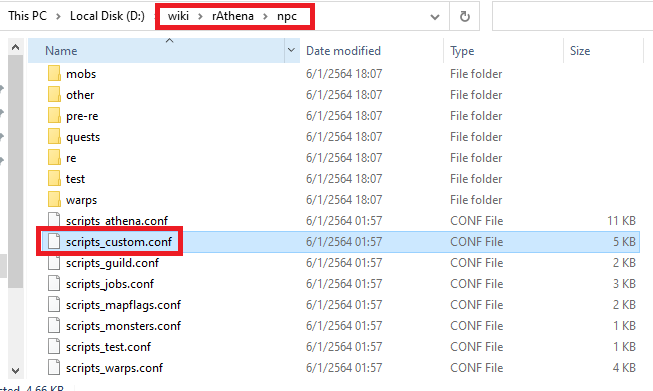
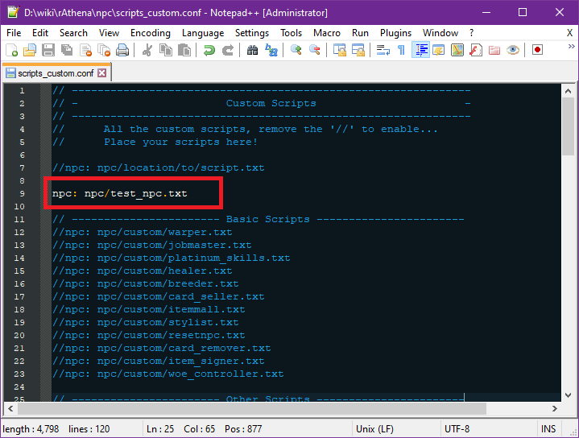
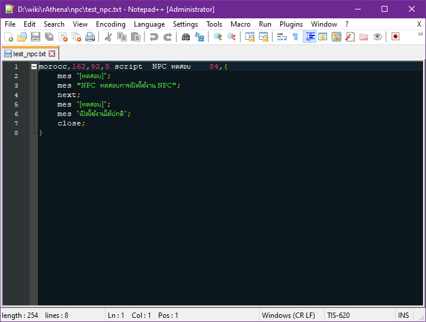
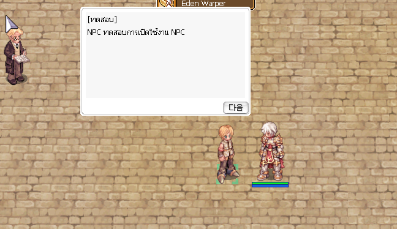

### ลง Script NPC



ให้เตรียมไฟล์ NPC ที่ต้องการจะลงให้พร้อม จากนั้นเข้าไปที่ folder ของ emulator ที่ใช้ rAthena/Hercules
แล้วเปิดเข้า folder "npc" จากนั้นเปิดไฟล์ "scripts_custom.conf" ด้วย Editor ที่ถนัด

**หากต้องการทำ NPC ภาษาไทยให้ทำการแก้ Encoding เป็นไทยหลังจากทำการเปิดไฟล์ด้วย Editor แล้ว**{: style="color: red;" }



สังเกตุกรอบสีแดง เป็นการเพิ่มไฟล์ NPC หรือ script NPC ที่เราต้องการใช้งานเข้าไป คำสั่งเพิ่มตัวอย่าง

```text
npc: npc/<ตำแหน่ง folder>/<ชื่อไฟล์>.txt
```



สำหรับตัวอย่าง จะใช้ชื่อไฟล์ test_npc.txt
```text
npc: npc/test_npc.txt
```

ทำการ save แล้วทำการรันเซิร์ฟเวอร์ดู หรือถ้าเปิดเซิร์ฟเวอร์ค้างอยู่สามารถใช้งานทำสั่ง

> @reloadscript

เพิ่มทำการสั่งให้เซิร์ฟเวอร์อ่านคำสั่ง script ใหม่ รวมถึง NPC จากนั้นทำการเข้าเกมส์เพื่อดูว่า npc ถูกเพิ่มเข้ามาหรือเปล่า



เป็นอันเสร็จการเพิ่ม NPC

```text
ตัวอย่าง script NPC

morocc,162,92,5	script	NPC ทดสอบ	84,{
	mes "[ทดสอบ]";
	mes "NPC ทดสอบการเปิดใช้งาน NPC";
	next;
	mes "[ทดสอบ]";
	mes "เปิดใช้งานได้ปกติ";
	close;
}
```